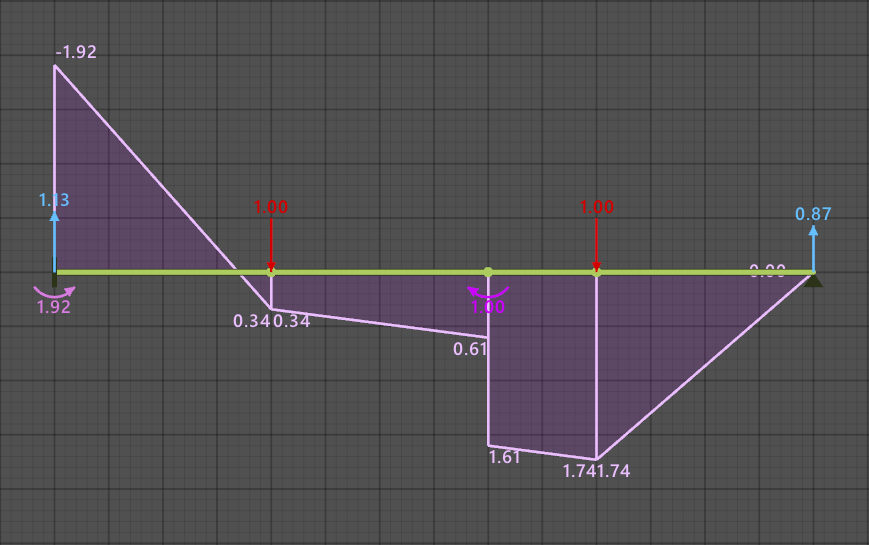

# Análise Estrutural Plana - AEP Solver

O AEP Solver é um software desenvolvido para resolver estruturas de barra utilizando o método dos elementos finitos com base na teoria da viga de Euler-Bernoulli. A formulação do problema se baseia na seguinte equação diferencial, que descreve o comportamento de uma viga sujeita a flexão:

$$
\frac{d^2}{dx^2}\left(EI\frac{d^2u}{dx^2}\right) = q(x)
$$

onde $E$ é o módulo de elasticidade do material, $I$ é o momento de inércia da seção transversal, $u(x)$ é a deflexão da viga na posição $x$ e $q(x)$ é a carga distribuída ao longo da viga.

## Como Usar

Para utilizar o programa, acesse a aba [Releases](https://github.com/EVWTRENTINI/AEP-Solver/releases/) do GitHub. Faça o download do arquivo [EAP-Solver.rar](https://github.com/EVWTRENTINI/AEP-Solver/releases/download/v0.3.0/EAP-Solver.rar), extraia todo arquivo zipado em seu computador e execute o aplicativo EAP Solver.exe.

**Siga os passos abaixo para executar o programa:**
1. Selecione 'Mais informações';
2. Depois selecione 'Executar assim mesmo'.

Essa medida é necessária apenas uma vez. Após confirmar, você poderá utilizar o AEP Solver sem restrições.

## Screenshots

Veja abaixo algumas imagens do AEP Solver em ação:

    
  
  
  

## Dependências

O software utiliza as seguintes bibliotecas:
- [Raylib](https://www.raylib.com/)
- [ImGui](https://github.com/ocornut/imgui)
- [Eigen](http://eigen.tuxfamily.org/index.php?title=Main_Page)

## Compilação

Para compilar o código-fonte, é necessário ter instalada a biblioteca Raylib. Recomenda-se o uso de [Visual Studio Code](https://code.visualstudio.com/) para facilitar a compilação e configuração do projeto.

## Licença

[Creative Commons Attribution-NonCommercial-ShareAlike 4.0 International](https://creativecommons.org/licenses/by-nc-sa/4.0/deed.en)

## Contato

Se você tiver qualquer dúvida ou sugestão, não hesite em entrar em contato:

- **Eduardo Vicente Wolf Trentini**
- Email: [eduardowtrentini@gmail.com](mailto:eduardowtrentini@gmail.com)

